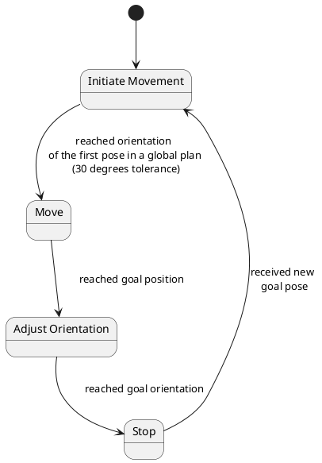

# humap_local_planner

A local planning module for A Framework to Simulate Human Behaviour in Robot Research

## Planner behaviour

Finite state machine of the planner is shown in the following diagram:



## Prerequisites

### `apt` packages

```bash
sudo apt install ros-$ROS_DISTRO-costmap-converter
```

### `teb_local_planner`

Slightly modified `teb_local_planner` (its 'utils' in particular) is currently required for operation:

ROS Kinetic
```bash
git clone -b robot-footprint-model-access-fix git@github.com:rayvburn/teb_local_planner.git
```

ROS Melodic:
```bash
git clone -b melodic-devel-robot-footprint-model-access-fix git@github.com:rayvburn/teb_local_planner.git
```

### `fuzzylite`

Additionally, `fuzzylite` library built from source is required to run `humap_local_planner`. Follow these steps:

```bash
cd ~/
mkdir libraries
cd libraries
git clone https://github.com/fuzzylite/fuzzylite.git
```

The run `fuzzylite/build.sh` script as pointed in [library build instructions](https://github.com/fuzzylite/fuzzylite#unix-1).
